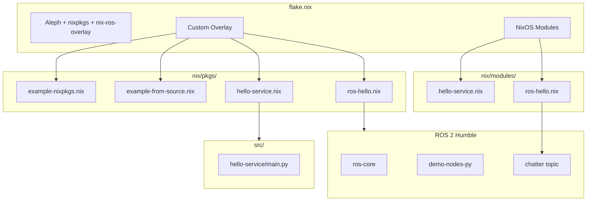

# Aleph ROS 2 Template Project

A template repository for robotics engineers building ROS 2 applications on the [Elodin Aleph](https://github.com/elodin-sys/elodin/tree/main/aleph) flight computer using Nix and NixOS.

https://github.com/user-attachments/assets/355d2ed5-3a75-4ed8-87d7-46d50a259fa0

This project demonstrates how to integrate ROS 2 Humble with Aleph's Nix-based development workflow, providing a solid foundation for building autonomous systems, drones, and robotic platforms.

## Features

- **ROS 2 Humble** pre-configured and running on Aleph
- **Nix-based reproducible builds** for reliable deployments
- **Four packaging patterns** from simple to complex
- **systemd integration** for production-ready services
- **Cross-compilation support** via remote builders

## Architecture Overview



## Prerequisites

Before you begin, ensure you have:

- **[Determinate Systems Nix](https://determinate.systems/nix-installer/)** installed on your development machine
- **An Aleph flight computer** with the base NixOS image flashed
- **Network connectivity** to your Aleph (WiFi or USB ethernet)
- **SSH access** configured (password or key-based)

### Install Nix

```bash
curl --proto '=https' --tlsv1.2 -sSf -L https://install.determinate.systems/nix | sh -s -- install
```

## Quick Start

### 1. Clone This Repository

```bash
git clone https://github.com/elodin-sys/aleph-template-project.git
cd aleph-template-project
```

### 2. Build the System

Test that everything compiles correctly:

```bash
nix build --accept-flake-config .#packages.aarch64-linux.toplevel --show-trace
```

> **Note:** The first build downloads ROS 2 packages from the [nix-ros-overlay Cachix cache](https://github.com/lopsided98/nix-ros-overlay), which significantly speeds up builds.

### 3. Deploy to Aleph

Once connected to your Aleph over the network:

```bash
./deploy.sh -h <aleph-hostname-or-ip> -u aleph
```

For example:
```bash
./deploy.sh -h aleph-24a5.local -u aleph
./deploy.sh -h 192.168.4.181 -u aleph
```

### 4. Verify ROS 2 is Running

SSH into your Aleph and verify ROS 2:

```bash
ssh -i ./ssh/aleph-key aleph@<aleph-ip>

# Check the ROS 2 talker service is running
systemctl status ros-hello

# Watch the ROS 2 output
journalctl -u ros-hello -f

# List ROS 2 topics
ros2 topic list

# Echo messages from the talker
ros2 topic echo /chatter
```

You should see output like:
```
[INFO] [talker]: Publishing: "Hello World: 42"
[INFO] [talker]: Publishing: "Hello World: 43"
...
```

## Initial Aleph Setup

If your Aleph is fresh out of the box or you've lost network connectivity, you'll need to configure it via the serial console.

### Connecting via Serial (FTDI)

1. Connect a USB cable to the Aleph's FTDI debug port
2. Find the serial device:
   ```bash
   ls /dev/tty.usbserial-*  # macOS
   ls /dev/ttyUSB*          # Linux
   ```
3. Connect with screen:
   ```bash
   screen /dev/tty.usbserial-XXXXX 115200
   # or on Linux:
   screen /dev/ttyUSB0 115200
   ```
4. Press Enter to get a login prompt
5. Login as `root`, default password is `root`

### Configuring WiFi

Once connected via serial, use `iwctl` to configure WiFi:

```bash
# Start the interactive WiFi tool
iwctl

# Inside iwctl:
station wlan0 scan
station wlan0 get-networks
station wlan0 connect "YourNetworkName"
# Enter password when prompted
exit

# Verify connection
ip addr show wlan0
ping -c 3 google.com
```

### Finding Your Aleph's IP Address

```bash
# On the Aleph (via serial or existing SSH):
ip addr show wlan0

# Or use mDNS from your development machine:
ping aleph-XXXX.local  # where XXXX is the last 4 chars of the serial number
```

## Project Structure

```
aleph-template-project/
├── flake.nix                          # Main Nix configuration (overlay, modules, dev shell)
├── flake.lock                         # Locked dependency versions
├── deploy.sh                          # Deployment script
├── README.md                          # This file
├── nix/
│   ├── modules/
│   │   ├── hello-service.nix          # Python service module (Pattern 3)
│   │   ├── ros-hello.nix              # ROS 2 service module (Pattern 4)
│   │   └── python-env.nix             # Unified Python environment (pyzed, numpy, opencv, etc.)
│   └── pkgs/
│       ├── example-nixpkgs.nix        # Using nixpkgs (Pattern 1)
│       ├── example-from-source.nix    # Building from source (Pattern 2)
│       ├── hello-service.nix          # Local Python package (Pattern 3)
│       ├── ros-hello.nix              # ROS 2 package (Pattern 4)
│       ├── zed-sdk.nix                # Stereolabs ZED SDK (x86_64 + Jetson)
│       └── pyzed.nix                  # ZED Python API (built from source)
├── src/
│   └── hello-service/
│       └── main.py                    # Python application source
└── ssh/
    ├── aleph-key                      # SSH private key
    └── aleph-key.pub                  # SSH public key
```

## Four Patterns Demonstrated

This template demonstrates four common patterns for adding software to your Aleph:

### Pattern 1: Using Packages from nixpkgs

**File:** `nix/pkgs/example-nixpkgs.nix`

The simplest pattern—use packages that already exist in nixpkgs. This example wraps `btop` (a modern resource monitor) with a custom launcher script called `aleph-monitor`.

```nix
# In your overlay:
example-nixpkgs = final.callPackage ./nix/pkgs/example-nixpkgs.nix {};

# In environment.systemPackages:
example-nixpkgs  # Available as 'aleph-monitor' command
```

**When to use:** For well-supported packages in nixpkgs that you want to include or customize.

### Pattern 2: Building from Source

**File:** `nix/pkgs/example-from-source.nix`

Fetch source code from GitHub and build it. This example builds `lazygit` from the official repository.

```nix
# Key elements:
src = fetchFromGitHub {
  owner = "jesseduffield";
  repo = "lazygit";
  rev = "v${version}";
  hash = "sha256-...";  # Use nix-prefetch-github to get this
};
```

**When to use:** For packages not in nixpkgs, specific versions, forks, or custom patches.

### Pattern 3: Local Python Application as systemd Service

**Files:**
- `src/hello-service/main.py` — Python source code
- `nix/pkgs/hello-service.nix` — Nix package definition
- `nix/modules/hello-service.nix` — NixOS module with systemd service

This pattern packages your own Python application and deploys it as a managed systemd service with configurable options.

```nix
# In flake.nix:
services.hello-service = {
  enable = true;
  message = "Hello from Aleph Template Project!";
  interval = 30;
};
```

**When to use:** For your own applications that need to run as background services.

### Pattern 4: ROS 2 Package with nix-ros-overlay

**Files:**
- `nix/pkgs/ros-hello.nix` — ROS 2 environment package
- `nix/modules/ros-hello.nix` — NixOS module with systemd service

This pattern uses [nix-ros-overlay](https://github.com/lopsided98/nix-ros-overlay) to build ROS 2 environments and run ROS nodes as systemd services.

```nix
# In nix/pkgs/ros-hello.nix:
let
  rosEnv = rosPackages.humble.buildEnv {
    paths = with rosPackages.humble; [
      ros-core
      demo-nodes-py
      demo-nodes-cpp
    ];
  };
in
stdenv.mkDerivation {
  # ... wrapper around ros2 run
}

# In flake.nix:
services.ros-hello = {
  enable = true;
};
```

**When to use:** For ROS 2 robotics applications, sensor processing, motion control, and autonomous systems.

## Adding Your Own ROS 2 Nodes

### Step 1: Create Your ROS 2 Package

Create a new package in `nix/pkgs/my-ros-node.nix`:

```nix
{ lib, rosPackages, stdenv, makeWrapper }:

let
  rosEnv = rosPackages.humble.buildEnv {
    paths = with rosPackages.humble; [
      ros-core
      rclpy           # Python ROS 2 client
      std-msgs        # Standard message types
      sensor-msgs     # Sensor message types
      geometry-msgs   # Geometry message types
      # Add more ROS packages as needed
    ];
  };
in
stdenv.mkDerivation {
  pname = "my-ros-node";
  version = "1.0.0";

  dontUnpack = true;
  nativeBuildInputs = [ makeWrapper ];

  installPhase = ''
    mkdir -p $out/bin
    makeWrapper ${rosEnv}/bin/ros2 $out/bin/my-ros-node \
      --add-flags "run my_package my_node"
  '';
}
```

### Step 2: Create a NixOS Module

Create `nix/modules/my-ros-node.nix`:

```nix
{ config, lib, pkgs, ... }:

with lib;

let cfg = config.services.my-ros-node;
in {
  options.services.my-ros-node = {
    enable = mkEnableOption "My ROS 2 node";
  };

  config = mkIf cfg.enable {
    systemd.services.my-ros-node = {
      description = "My ROS 2 Node";
      after = [ "network.target" ];
      wantedBy = [ "multi-user.target" ];

      environment = {
        HOME = "/var/lib/my-ros-node";
        ROS_HOME = "/var/lib/my-ros-node/.ros";
        ROS_LOG_DIR = "/var/lib/my-ros-node/.ros/log";
      };

      serviceConfig = {
        ExecStart = "${pkgs.my-ros-node}/bin/my-ros-node";
        StateDirectory = "my-ros-node";
        Restart = "always";
      };
    };
  };
}
```

### Step 3: Wire It Up in flake.nix

Add to the overlay and enable the module:

```nix
# In overlays.default:
my-ros-node = final.callPackage ./nix/pkgs/my-ros-node.nix {};

# In nixosModules.default imports:
./nix/modules/my-ros-node.nix

# Enable the service:
services.my-ros-node.enable = true;
```

## Available ROS 2 Packages

The [nix-ros-overlay](https://github.com/lopsided98/nix-ros-overlay) provides 1500+ ROS 2 packages for Humble. Common packages include:

| Category | Packages |
|----------|----------|
| **Core** | `ros-core`, `rclpy`, `rclcpp` |
| **Messages** | `std-msgs`, `sensor-msgs`, `geometry-msgs`, `nav-msgs` |
| **Perception** | `image-transport`, `cv-bridge`, `pcl-ros` |
| **Navigation** | `nav2-bringup`, `slam-toolbox`, `robot-localization` |
| **Control** | `ros2-control`, `ros2-controllers` |
| **Visualization** | `rviz2`, `rqt` |
| **Simulation** | `gazebo-ros-pkgs` |

To find available packages:
```bash
# In a nix repl:
nix repl
:lf .
rosPackages.humble.<TAB>
```

## Customizing for Your Project

### Step 1: Fork/Clone This Repository

```bash
git clone https://github.com/elodin-sys/aleph-template-project.git my-robot-project
cd my-robot-project
rm -rf .git
git init
```

### Step 2: Generate Your Own SSH Keys

```bash
rm ssh/aleph-key ssh/aleph-key.pub
ssh-keygen -t ed25519 -f ssh/aleph-key -C "my-robot-project"
```

Update `flake.nix` with your new public key:
```nix
users.users.aleph = {
  openssh.authorizedKeys.keys = [
    "ssh-ed25519 AAAA... your-new-key"
  ];
};
```

### Step 3: Customize ROS 2 Packages

Edit `nix/pkgs/ros-hello.nix` to include the ROS 2 packages your robot needs:

```nix
rosEnv = rosPackages.humble.buildEnv {
  paths = with rosPackages.humble; [
    ros-core
    sensor-msgs
    geometry-msgs
    nav-msgs
    tf2-ros
    robot-state-publisher
    # Your custom packages...
  ];
};
```

### Step 4: Remove Example Code

Once you're comfortable, remove the example patterns:
- Delete `nix/pkgs/example-*.nix`
- Delete `nix/modules/hello-service.nix` and `src/hello-service/`
- Keep or modify `ros-hello` as a starting point

## ZED Camera Development (Local)

This project includes a Nix dev shell with the [Stereolabs ZED SDK](https://www.stereolabs.com/developers/) 5.1 and Python bindings (pyzed, numpy, OpenCV, matplotlib), ready for use with a ZED camera connected to your x86_64 Ubuntu laptop via USB.

### Getting Started

Connect your ZED camera via USB, then:

```bash
nix develop
```

On the first run the shell will ask for your sudo password to install USB access rules for the camera (one-time). After that, every `nix develop` is instant.

### Show a Live Video Stream

Open a live camera feed with OpenCV (press `q` to quit):

```bash
python3 src/zed-viewer.py
```

### Quick Smoke Test (No Display Required)

Verify the SDK can talk to the camera without needing a GUI:

```bash
python3 src/zed-test.py
```

### View from Aleph over SSH

With a ZED camera plugged into the Aleph, you can view the live feed on your laptop using SSH X11 forwarding. Copy the remote viewer script to the Aleph and run it:

```bash
scp -i ./ssh/aleph-key src/zed-viewer-remote.py aleph@<aleph-ip>:
ssh -X -i ./ssh/aleph-key aleph@<aleph-ip> "python3 zed-viewer-remote.py"
```

A window will appear on your laptop showing the Aleph's camera feed. Press `q` to quit.
*Note*: for best results, use a powered USB-C 3.0 hub connected to the Aleph SuperSpeed port (middle side), to avoid any negotiation issues.

## Deployment Options

### Standard Deployment (Recommended)

Uses your local machine or configured remote builders:

```bash
./deploy.sh -h <host> -u aleph -k ./ssh/aleph-key
```

### Build on Aleph (Slower)

If you don't have an aarch64 builder, the script will automatically build on the Aleph itself:

```bash
./deploy.sh -h <host> -u aleph -k ./ssh/aleph-key
# Script will detect missing builder and use Aleph
```

### Skip Remote Builder Detection

Force local/configured builder usage:

```bash
./deploy.sh -h <host> -u aleph -k ./ssh/aleph-key --no-aleph-builder
```

## Troubleshooting

### ROS 2 Service Not Starting

```bash
# Check service status
systemctl status ros-hello

# View detailed logs
journalctl -u ros-hello -f

# Common issues:
# 1. Log directory permissions - ensure StateDirectory is set
# 2. Missing ROS packages - check rosEnv paths
# 3. Environment variables - verify HOME/ROS_HOME are set
```

### ROS 2 Topics Not Visible

```bash
# Ensure ROS 2 environment is sourced
ros2 topic list

# Check if the node is running
ros2 node list

# Verify network settings (for multi-machine setups)
export ROS_DOMAIN_ID=0
```

### Can't Connect to Aleph

1. **Check physical connection:** Ensure Aleph is powered and connected
2. **Try mDNS:** `ping aleph-XXXX.local`
3. **Fall back to serial:** Connect via FTDI and check network config
4. **Check WiFi:** Run `iwctl` to verify/reconfigure WiFi

### Build Failures

1. **Hash mismatch:** Update the hash in your package definition

2. **Missing ROS dependencies:** Add packages to your `rosEnv.paths`

3. **Evaluation errors:** Run with `--show-trace` for detailed errors
   ```bash
   nix build --accept-flake-config .#packages.aarch64-linux.toplevel --show-trace
   ```

### SSH Key Not Working

1. Verify the key file exists and has correct permissions:
   ```bash
   ls -la ssh/aleph-key
   chmod 600 ssh/aleph-key
   ```

2. Ensure the public key is in `flake.nix`

3. Use the `aleph` user (not `root`) for deployment:
   ```bash
   ./deploy.sh -h <host> -u aleph
   ```

## Useful Commands

### On Your Development Machine

```bash
# Build the system
nix build --accept-flake-config .#packages.aarch64-linux.toplevel

# Note for the first deploy you need to deploy as root to install the user and key
./deploy.sh -h <host> -u root # it will prompt you for password: "root"

# Deploy to Aleph
./deploy.sh -h <host> -u aleph # no prompt, seamless deploy

# SSH to Aleph
ssh -i ./ssh/aleph-key aleph@<host>
```

### On the Aleph

```bash
# ROS 2 commands
ros2 topic list
ros2 topic echo /chatter
ros2 node list
ros2 node info /talker

# Service management
systemctl status ros-hello
journalctl -u ros-hello -f
systemctl restart ros-hello

# System info
neofetch
btop

# Network info
ip addr
iwctl station wlan0 show

# Check NixOS generation
nixos-rebuild list-generations
```

## Resources

### Elodin & Aleph
- [Elodin GitHub Repository](https://github.com/elodin-sys/elodin)
- [Elodin Documentation](https://docs.elodin.systems)
- [Aleph Modules Source](https://github.com/elodin-sys/elodin/tree/main/aleph)

### ROS 2 & nix-ros-overlay
- [nix-ros-overlay](https://github.com/lopsided98/nix-ros-overlay) - ROS packages for Nix
- [ROS 2 Humble Documentation](https://docs.ros.org/en/humble/)
- [ROS 2 Tutorials](https://docs.ros.org/en/humble/Tutorials.html)

### Nix
- [NixOS Manual](https://nixos.org/manual/nixos/stable/)
- [Nix Pills (Learning Resource)](https://nixos.org/guides/nix-pills/)

## License

This template is provided under the Apache-2.0 license. See [LICENSE](LICENSE) for details.
