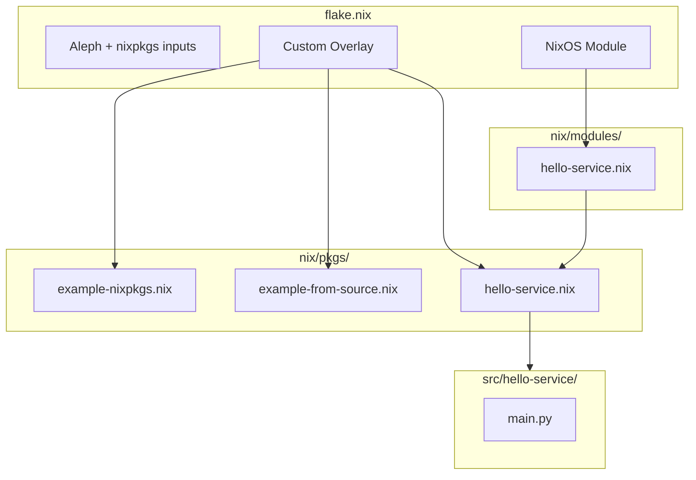

# Aleph Template Project

A template repository demonstrating the Nix-based development and deployment workflow for the [Elodin Aleph](https://github.com/elodin-sys/elodin/tree/main/aleph) flight computer.

This project serves as a starting point for building your own custom Aleph software stack. It demonstrates three common patterns for packaging and deploying software to Aleph using NixOS.

## Architecture Overview



## Prerequisites

Before you begin, ensure you have:

- **[Determinate Systems Nix](https://determinate.systems/nix-installer/)** installed on your development machine
- **An Aleph flight computer** with the base NixOS image flashed
- **Network connectivity** to your Aleph (WiFi or USB ethernet)
- **SSH access** configured (password or key-based)

### Install Nix

```bash
curl --proto '=https' --tlsv1.2 -sSf -L https://install.determinate.systems/nix | sh -s -- install
```

## Quick Start

### 1. Clone This Repository

```bash
git clone https://github.com/elodin-sys/aleph-template-project.git
cd aleph-template-project
```

### 2. Build the System

Test that everything compiles correctly:

```bash
nix build --accept-flake-config .#packages.aarch64-linux.toplevel --show-trace
```

### 3. Deploy to Aleph

Once connected to your Aleph over the network:

```bash
./deploy.sh -h <aleph-hostname-or-ip> -u root
```

For example:
```bash
./deploy.sh -h aleph-24a5.local -u root
./deploy.sh -h 192.168.4.181 -u root
```

### 4. Verify Deployment

SSH into your Aleph and check that everything is working:

```bash
ssh -i ./ssh/aleph-key aleph@<aleph-ip>

# Check the hello-service is running
journalctl -u hello-service -f

# Try the example commands
aleph-monitor  # btop wrapper (Pattern 1)
lazygit        # Built from source (Pattern 2)
```

## Initial Aleph Setup

If your Aleph is fresh out of the box or you've lost network connectivity, you'll need to configure it via the serial console.

### Connecting via Serial (FTDI)

1. Connect a USB cable to the Aleph's FTDI debug port
2. Find the serial device:
   ```bash
   ls /dev/tty.usbserial-*  # macOS
   ls /dev/ttyUSB*          # Linux
   ```
3. Connect with screen:
   ```bash
   screen /dev/tty.usbserial-XXXXX 115200
   # or on Linux:
   screen /dev/ttyUSB0 115200
   ```
4. Press Enter to get a login prompt
5. Login as `root`, default password is `root`

### Configuring WiFi

Once connected via serial, use `iwctl` to configure WiFi:

```bash
# Start the interactive WiFi tool
iwctl

# Inside iwctl:
station wlan0 scan
station wlan0 get-networks
station wlan0 connect "YourNetworkName"
# Enter password when prompted
exit

# Verify connection
ip addr show wlan0
ping -c 3 google.com
```

### Finding Your Aleph's IP Address

```bash
# On the Aleph (via serial or existing SSH):
ip addr show wlan0

# Or use mDNS from your development machine:
ping aleph-XXXX.local  # where XXXX is the last 4 chars of the serial number
```

## Project Structure

```
aleph-template-project/
├── flake.nix                          # Main Nix configuration
├── flake.lock                         # Locked dependency versions
├── deploy.sh                          # Deployment script
├── README.md                          # This file
├── nix/
│   ├── modules/
│   │   └── hello-service.nix          # NixOS module (Pattern 3)
│   └── pkgs/
│       ├── example-nixpkgs.nix        # Using nixpkgs (Pattern 1)
│       ├── example-from-source.nix    # Building from source (Pattern 2)
│       └── hello-service.nix          # Local Python package (Pattern 3)
├── src/
│   └── hello-service/
│       └── main.py                    # Python application source
└── ssh/
    ├── aleph-key                      # SSH private key
    └── aleph-key.pub                  # SSH public key
```

## Three Patterns Demonstrated

This template demonstrates three common patterns for adding software to your Aleph:

### Pattern 1: Using Packages from nixpkgs

**File:** `nix/pkgs/example-nixpkgs.nix`

The simplest pattern—use packages that already exist in nixpkgs. This example wraps `btop` (a modern resource monitor) with a custom launcher script called `aleph-monitor`.

```nix
# In your overlay:
example-nixpkgs = final.callPackage ./nix/pkgs/example-nixpkgs.nix {};

# In environment.systemPackages:
example-nixpkgs  # Available as 'aleph-monitor' command
```

**When to use:** For well-supported packages in nixpkgs that you want to include or customize.

### Pattern 2: Building from Source

**File:** `nix/pkgs/example-from-source.nix`

Fetch source code from GitHub and build it. This example builds `lazygit` from the official repository.

```nix
# Key elements:
src = fetchFromGitHub {
  owner = "jesseduffield";
  repo = "lazygit";
  rev = "v${version}";
  hash = "sha256-...";  # Use nix-prefetch-github to get this
};
```

**When to use:** For packages not in nixpkgs, specific versions, forks, or custom patches.

### Pattern 3: Local Python Application as systemd Service

**Files:**
- `src/hello-service/main.py` — Python source code
- `nix/pkgs/hello-service.nix` — Nix package definition
- `nix/modules/hello-service.nix` — NixOS module with systemd service

This pattern packages your own Python application and deploys it as a managed systemd service with configurable options.

```nix
# In flake.nix:
services.hello-service = {
  enable = true;
  message = "Hello from Aleph Template Project!";
  interval = 30;
};
```

**When to use:** For your own applications that need to run as background services.

## Customizing for Your Project

### Step 1: Fork/Clone This Repository

```bash
git clone https://github.com/elodin-sys/aleph-template-project.git my-aleph-project
cd my-aleph-project
rm -rf .git
git init
```

### Step 2: Generate Your Own SSH Keys

```bash
rm ssh/aleph-key ssh/aleph-key.pub
ssh-keygen -t ed25519 -f ssh/aleph-key -C "my-aleph-project"
```

Update `flake.nix` with your new public key:
```nix
users.users.aleph = {
  openssh.authorizedKeys.keys = [
    "ssh-ed25519 AAAA... your-new-key"
  ];
};
```

### Step 3: Add Your Own Packages

1. Create a new file in `nix/pkgs/your-package.nix`
2. Add it to the overlay in `flake.nix`:
   ```nix
   overlays.default = final: prev: {
     your-package = final.callPackage ./nix/pkgs/your-package.nix {};
   };
   ```
3. Include it in `environment.systemPackages` or create a module for it

### Step 4: Add Your Own Services

1. Create your application source in `src/your-service/`
2. Create a package in `nix/pkgs/your-service.nix`
3. Create a NixOS module in `nix/modules/your-service.nix`
4. Import the module in `flake.nix` and enable it

### Step 5: Remove Example Code

Once you're comfortable, remove the example patterns:
- Delete `nix/pkgs/example-*.nix`
- Delete `nix/modules/hello-service.nix` and related files
- Remove references from `flake.nix`

## Deployment Options

### Standard Deployment (Recommended)

Uses your local machine or configured remote builders:

```bash
./deploy.sh -h <host> -u <user>
```

### Build on Aleph (Slower)

If you don't have an aarch64 builder, the script will automatically build on the Aleph itself:

```bash
./deploy.sh -h <host> -u <user>
# Script will detect missing builder and use Aleph
```

### Skip Remote Builder Detection

Force local/configured builder usage:

```bash
./deploy.sh -h <host> -u <user> --no-aleph-builder
```

## Troubleshooting

### Can't Connect to Aleph

1. **Check physical connection:** Ensure Aleph is powered and connected
2. **Try mDNS:** `ping aleph-XXXX.local`
3. **Fall back to serial:** Connect via FTDI and check network config
4. **Check WiFi:** Run `iwctl` to verify/reconfigure WiFi

### Serial Connection Issues

```bash
# macOS: Find the device
ls /dev/tty.usbserial-*

# Linux: Find the device
ls /dev/ttyUSB*

# Connect (115200 baud)
screen /dev/tty.usbserial-XXXXX 115200

# Exit screen: Ctrl+A, then K, then Y
```

### SSH Key Not Working

1. Verify the key file exists and has correct permissions:
   ```bash
   ls -la ssh/aleph-key
   chmod 600 ssh/aleph-key
   ```

2. Ensure the public key is in `flake.nix`:
   ```bash
   cat ssh/aleph-key.pub
   # Compare with openssh.authorizedKeys.keys in flake.nix
   ```

3. Redeploy after any key changes:
   ```bash
   ./deploy.sh -h <host> -u root
   ```

### Build Failures

1. **Hash mismatch:** Update the hash in your package definition
   ```bash
   # The error will show the expected hash, copy it
   ```

2. **Missing dependencies:** Check `buildInputs` and `nativeBuildInputs`

3. **Evaluation errors:** Run with `--show-trace` for detailed errors
   ```bash
   nix build --accept-flake-config .#packages.aarch64-linux.toplevel --show-trace
   ```

### Service Not Starting

```bash
# Check service status
systemctl status hello-service

# View logs
journalctl -u hello-service -f

# Restart service
systemctl restart hello-service
```

## Useful Commands

### On Your Development Machine

```bash
# Build the system
nix build --accept-flake-config .#packages.aarch64-linux.toplevel

# Deploy to Aleph
./deploy.sh -h <host> -u root

# SSH to Aleph
ssh -i ./ssh/aleph-key aleph@<host>
```

### On the Aleph

```bash
# System info
neofetch
btop

# Service management
systemctl status hello-service
journalctl -u hello-service -f

# Network info
ip addr
iwctl station wlan0 show

# Check NixOS generation
nixos-rebuild list-generations
```

## Resources

- [Elodin GitHub Repository](https://github.com/elodin-sys/elodin)
- [Elodin Documentation](https://docs.elodin.systems)
- [Aleph Modules Source](https://github.com/elodin-sys/elodin/tree/main/aleph)
- [NixOS Manual](https://nixos.org/manual/nixos/stable/)
- [Nix Pills (Learning Resource)](https://nixos.org/guides/nix-pills/)

## License

This template is provided under the Apache-2.0 license. See [LICENSE](LICENSE) for details.

